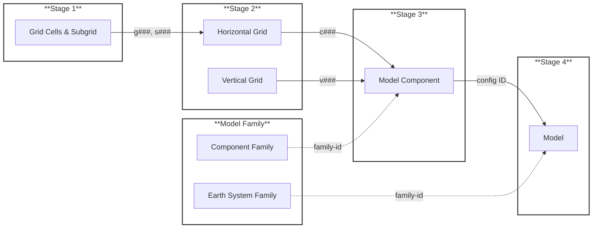

# EMD Registration Workflow

## Submission Pipeline

## Quick Reference

| Stage | Form | Creates | ID Format | Used By |
|-------|------|---------|-----------|---------|
| 1 | [Grid Cells & Subgrid](https://github.com/WCRP-CMIP/Essential-Model-Documentation/issues/new?template=grid_cell_and_subgrid.yml) | grid_cells + subgrid | g###, s### | Stage 2a |
| 2a | [Horizontal Grid](https://github.com/WCRP-CMIP/Essential-Model-Documentation/issues/new?template=horizontal_computational_grid.yml) | horizontal_computational_grid | c### | Stage 3 |
| 2b | [Vertical Grid](https://github.com/WCRP-CMIP/Essential-Model-Documentation/issues/new?template=vertical_computational_grid.yml) | vertical_computational_grid | v### | Stage 3 |
| 3 | [Model Component](https://github.com/WCRP-CMIP/Essential-Model-Documentation/issues/new?template=model_component.yml) | component + component_config | {domain}_{name}_{c###}_{v###} | Stage 4 |
| 4 | [Model](https://github.com/WCRP-CMIP/Essential-Model-Documentation/issues/new?template=model.yml) | model | source_id | CMIP |
| — | [Earth System Family](https://github.com/WCRP-CMIP/Essential-Model-Documentation/issues/new?template=model_family.yml) | model_family | family-id | Stage 4 |
| — | [Component Family](https://github.com/WCRP-CMIP/Essential-Model-Documentation/issues/new?template=model_family.yml) | model_family | family-id | Stage 3 |
