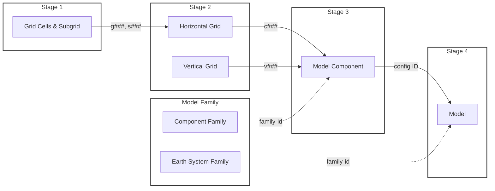

# EMD Registration Workflow

## Submission Pipeline

![EMD Workflow](https://mermaid.ink/svg/Zmxvd2NoYXJ0IExSCiAgICBzdWJncmFwaCBTdGFnZTFbIlN0YWdlIDEiXQogICAgICAgIFMxWyJHcmlkIENlbGxzICYgU3ViZ3JpZCJdCiAgICBlbmQKICAgIHN1YmdyYXBoIFN0YWdlMlsiU3RhZ2UgMiJdCiAgICAgICAgZGlyZWN0aW9uIFRCCiAgICAgICAgUzJhWyJIb3Jpem9udGFsIEdyaWQiXQogICAgICAgIFMyYlsiVmVydGljYWwgR3JpZCJdCiAgICBlbmQKICAgIHN1YmdyYXBoIE1GWyJNb2RlbCBGYW1pbHkiXQogICAgICAgIGRpcmVjdGlvbiBUQgogICAgICAgIEVTTVsiRWFydGggU3lzdGVtIEZhbWlseSJdCiAgICAgICAgQ0ZbIkNvbXBvbmVudCBGYW1pbHkiXQogICAgZW5kCiAgICBzdWJncmFwaCBTdGFnZTNbIlN0YWdlIDMiXQogICAgICAgIFMzWyJNb2RlbCBDb21wb25lbnQiXQogICAgZW5kCiAgICBzdWJncmFwaCBTdGFnZTRbIlN0YWdlIDQiXQogICAgICAgIFM0WyJNb2RlbCJdCiAgICBlbmQKICAgIFMxIC0tPnxnIyMjLCBzIyMjfCBTMmEKICAgIFMyYSAtLT58YyMjI3wgUzMKICAgIFMyYiAtLT58diMjI3wgUzMKICAgIFMzIC0tPnxjb25maWcgSUR8IFM0CiAgICBFU00gLS4tPnxmYW1pbHktaWR8IFM0CiAgICBDRiAtLi0-fGZhbWlseS1pZHwgUzMKICAgIHN0eWxlIFN0YWdlMSBzdHJva2U6IzMzMyxzdHJva2Utd2lkdGg6MnB4LGZpbGw6bm9uZQogICAgc3R5bGUgU3RhZ2UyIHN0cm9rZTojMzMzLHN0cm9rZS13aWR0aDoycHgsZmlsbDpub25lCiAgICBzdHlsZSBNRiBzdHJva2U6IzMzMyxzdHJva2Utd2lkdGg6MnB4LGZpbGw6bm9uZQogICAgc3R5bGUgU3RhZ2UzIHN0cm9rZTojMzMzLHN0cm9rZS13aWR0aDoycHgsZmlsbDpub25lCiAgICBzdHlsZSBTdGFnZTQgc3Ryb2tlOiMzMzMsc3Ryb2tlLXdpZHRoOjJweCxmaWxsOm5vbmU=)

## Quick Reference

| Stage | Form | Creates | ID Format | Used By |
|-------|------|---------|-----------|---------|
| 1 | [Grid Cells & Subgrid](https://github.com/WCRP-CMIP/Essential-Model-Documentation/issues/new?template=grid_cell_and_subgrid.yml) | grid_cells + subgrid | g###, s### | Stage 2a |
| 2a | [Horizontal Grid](https://github.com/WCRP-CMIP/Essential-Model-Documentation/issues/new?template=horizontal_computational_grid.yml) | horizontal_computational_grid | c### | Stage 3 |
| 2b | [Vertical Grid](https://github.com/WCRP-CMIP/Essential-Model-Documentation/issues/new?template=vertical_computational_grid.yml) | vertical_computational_grid | v### | Stage 3 |
| 3 | [Model Component](https://github.com/WCRP-CMIP/Essential-Model-Documentation/issues/new?template=model_component.yml) | component + component_config | {domain}_{name}_{c###}_{v###} | Stage 4 |
| 4 | [Model](https://github.com/WCRP-CMIP/Essential-Model-Documentation/issues/new?template=model.yml) | model | source_id | CMIP |
| — | [Earth System Family](https://github.com/WCRP-CMIP/Essential-Model-Documentation/issues/new?template=model_family.yml) | model_family | family-id | Stage 4 |
| — | [Component Family](https://github.com/WCRP-CMIP/Essential-Model-Documentation/issues/new?template=model_family.yml) | model_family | family-id | Stage 3 |

---

## Diagram Source

The workflow diagram is rendered via [mermaid.ink](https://mermaid.ink). To regenerate the URLs after modifying the diagram, use `_workflow_images.py` or encode the mermaid source as base64:

To highlight a stage, add: `style StageX stroke:#0066cc,stroke-width:3px,fill:none`
