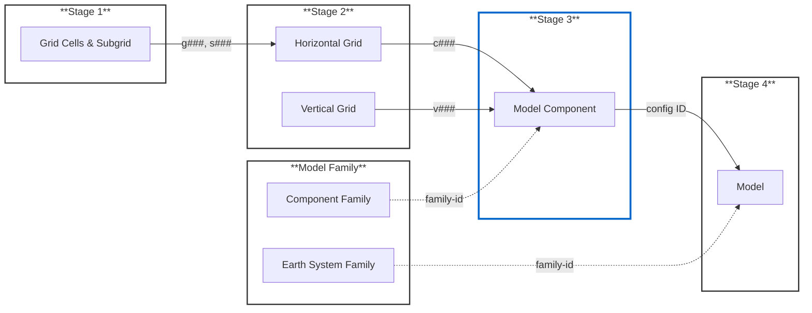

# Essential-Model-Documentation
TESTING ONLY: Development repository for the EMD. This will link into the CVs and Universe Repos. 

 

-------

> [!CAUTION]
> ### THIS REPOSITORY IS CURRENTLY UNDER ACTIVE DEVELOPMENT

--------

## Submitting EMD 
The submission process for the Essential Model Documentation (EMD) follows a 4 stage process. If your grids and model/component families have already been registered from previous projects, please start at Stage 3 (blue). Otherwise start at the beginning and ensure your grid cells, grids and families have been added. Subsequent submissions should get progressively quicker the more information that has been entered in the EMD. 
 

## JSON branch structure (ignore these and use esgvoc for now)

| Required |  |
|--------|-------------|
| [`main`](https://github.com/WCRP-CMIP/Essential-Model-Documentation/tree/main) | The landing page directing users to the relevant content. |
| [`docs`](https://github.com/WCRP-CMIP/Essential-Model-Documentation/tree/docs) | Contains the documentation and is version-controlled. This is the branch where documentation edits are made. Actions and automations (e.g., workflows that update docs or summaries) are also configured from this branch. |
| [`src-data`](https://github.com/WCRP-CMIP/Essential-Model-Documentation/tree/src-data) | Stores the JSONLD content used to link all files. Updates here trigger automated workflows that identify changed JSON files and update documentation or summaries accordingly. |
| [`production`](https://github.com/WCRP-CMIP/Essential-Model-Documentation/tree/production) | Not for user digestion. Hosts the compiled documentation and JSONLD files, as well as the static pages site. Updated automatically via workflows when changes in `src-data` or `docs` are processed. |

| Optional |  |
|--------|-------------|
| `dev_*` | Other branches used for updating things. |
| `*` | All other branches are usually ones containing submissions to update the content. |

## Contributors

Thanks to our contributors!
