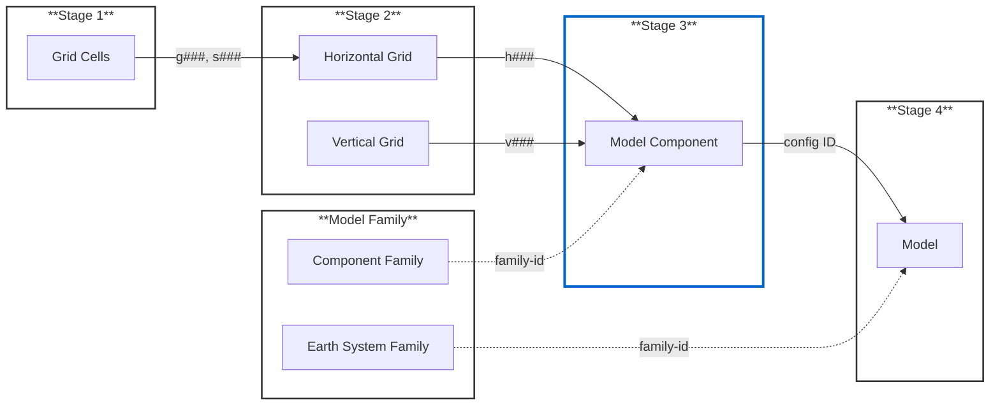

# EMD Submission Guide

This guide outlines how to submit Essential Model Documentation (EMD) for your climate model.

## Overview

EMD submission follows a **4-stage process**. If your grids and model/component families are already registered from previous projects, start at **Stage 3** (highlighted below). Otherwise, begin at Stage 1.

Subsequent submissions become faster as more shared information is registered.

##lick any box to open the corresponding form.

---

## Stage 1: Grid Cells & Subgrids

**Form:** [Grid Cell and Subgrid](https://github.com/WCRP-CMIP/Essential-Model-Documentation/issues/new?template=grid_cell_and_subgrid.yml)

Register the fundamental grid structure: cell geometry, coordinate systems, and subgrid definitions.

**Output:** Grid cell ID (`g###`) and subgrid ID (`s###`) for use in Stage 2.

---

## Stage 2: Computational Grids

**Forms:** [Horizontal Grid](https://github.com/WCRP-CMIP/Essential-Model-Documentation/issues/new?template=horizontal_computational_grid.yml) | [Vertical Grid](https://github.com/WCRP-CMIP/Essential-Model-Documentation/issues/new?template=vertical_computational_grid.yml)

Link subgrids into computational grids with specified staggering arrangements.

**Output:** Horizontal grid ID (`h###`) and vertical grid ID (`v###`) for use in Stage 3.

---

## Model Family (Optional)

**Form:** [Model Family](https://github.com/WCRP-CMIP/Essential-Model-Documentation/issues/new?template=model_family.yml)

Register a family of related models or components sharing common code. Two types:

- **Earth System Family** → referenced in Stage 4 (Model)
- **Component Family** → referenced in Stage 3 (Model Component)

**Output:** Family ID for linking related configurations.

---

## Stage 3: Model Components

**Form:** [Model Component](https://github.com/WCRP-CMIP/Essential-Model-Documentation/issues/new?template=model_component.yml)

Register individual model components (atmosphere, ocean, land surface, etc.) with their grid configurations.

**Output:** Component config ID (e.g., `ocean_nemo-v3-6_c101_v103`) for use in Stage 4.

!!! tip "Reusing Components"
    Pre-registered components appear in a dropdown at the top of the form. Select one to auto-populate fields, then modify as needed.

---

## Stage 4: Model (source_id)

**Form:** [Model](https://github.com/WCRP-CMIP/Essential-Model-Documentation/issues/new?template=model.yml)

Register the complete model configuration — the final step. This creates the official CMIP `source_id`.

**Input required:** Component config IDs from Stage 3, coupling relationships, calendar types.

---

## What Happens After Submission

1. **Validation** — Automated checks verify your submission
2. **Review** — Community scientific review for consistency
3. **Registration** — Approved entries are added to the EMD registry
4. **Dropdown Updates** — New entries appear in form dropdowns within ~24 hours

Track your submissions: [My Issues](https://github.com/WCRP-CMIP/Essential-Model-Documentation/issues?q=is%3Aissue+author%3A%40me)

---

## Quick Reference

| Stage | Form | You Provide | You Receive |
|-------|------|-------------|-------------|
| 1 | Grid Cell & Subgrid | Grid geometry, coordinates | `g###`, `s###` |
| 2a | Horizontal Grid | Subgrid IDs, arrangement | `h###` |
| 2b | Vertical Grid | Coordinate type, levels | `v###` |
| — | Model Family | Institution, scientific domains | Family ID |
| 3 | Model Component | Component details, grid IDs | Config ID |
| 4 | Model | Config IDs, coupling | `source_id` |
