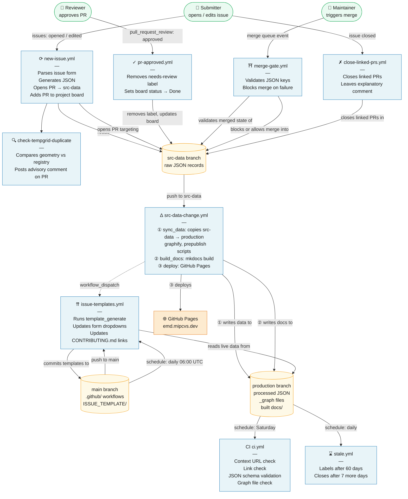

# How a Submission is Processed

This page describes the different workflows and actions that happen automatically in the repository. They are located at `.github/workflows` and often link one or more reusable actions across the CVs repos. Understanding this helps us identify the potential causes of any issues we may encounter. 

---

## The Submission Form

When a submitter opens the issue template [github.com/…/issues/new/choose](https://github.com/WCRP-CMIP/Essential-Model-Documentation/issues/new/choose), the forms they see are statically-dynamic. This means that they get periodically updated to allow new options / features when items are registered. 

The **Update Issue Templates** workflow (`issue-templates.yml`) is the backbone to this, and runs daily (incase new constants are added) and after every publication run on the EMD . This ensures new grid registrations become available to be selected in any consecutive stages. 

---

## When an Issue is Opened

The moment a form is submitted — or edited in case of a correction — the **New Issue Processing** workflow (`new-issue.yml`) fires. The `new_issue` command  parses the issue body extracting and formatting the form fields into an appropriate JSON record. For grids this takes on a temporary format:  (for example `horizontal_grid_cell/tempgrid_<username>-<id>.json`). Should the validation step succeed, then a new branch and pull request containing this information and summary script are created for review. If the validation is not successful, an automated issue comment is created telling the user exactly what they need to edit. 

---

## Duplicate Detection

Immediately after the PR is created, a second action (`check-tempgrid-duplicate`) runs against the new pull request. It compares the submitted grid  against all existing entries in the registry and comments if the new record appears to be a potential-duplicate of something already registered. 

[!warning] This is advisory: the submitter and reviewer should read the comment and decide whether the new record is genuinely distinct or whether the submitter should instead reference an existing ID. No automatic rejection occurs at this stage.

---

## The Pull Request

The submitter will see a new pull request in the [repository's PR list](https://github.com/WCRP-CMIP/Essential-Model-Documentation/pulls). The PR title mirrors the issue title, the body contains a `Resolves #N` link back to the originating issue, and the diff shows the JSON file that will be added to `src-data`. 

The PR is automatically added to the [Reviewer Project Board](https://github.com/orgs/WCRP-CMIP/projects/8), where it appears as an open item awaiting attention, and the `needs-review` label is applied to the linked issue to signal that it is in the review queue. If the submitter edits the issue body at any point, the workflow re-runs and updates the PR with fresh content — there is no need to close and reopen.

---

## Review and Approval

Reviewers work through the pull request using GitHub's standard review interface: reading the diff, leaving comments or suggestions on the issue, and approving the PR when satisfied. When a reviewer submits an approval, the **PR Approved** workflow (`pr-approved.yml`) fires. It parses the PR body to identify the linked issue number, removes the `needs-review` label from that issue, and updates the PR's status on the project board to *Done*. The approved PR then sits in the queue of items ready to merge, visible on the [already-reviewed filter](https://github.com/WCRP-CMIP/Essential-Model-Documentation/pulls?q=is%3Apr+is%3Aopen+-label%3Aneeds-review+review%3Aapproved). 

A second reviewer or maintainer performs a final sanity check before triggering the merge.

---

## Data Sync and Publication

When a PR is merged into `src-data`, the **src-data** workflow (`src-data-change.yml`) begins a multi-step pipeline. It checks out the `production` branch and replaces its vocabulary directories with the content of `src-data`, ensuring the published data always reflects the authoritative merged state. 

It then runs `graphify --all`, which generates the grouped JSONLD files (`_graph.json`) files for every record type — these are the machine-readable linked-data graphs consumed by downstream tools. 

Two prepublish scripts then run: 
1. the first creates extensionless copies of every JSON file so that `horizontal_grid_cell/g100` resolves as well as `horizontal_grid_cell/g100.json` (content negotiation for the linked-data layer); 
2. the second ensures context files are available under both their plain name and a `.json`-suffixed variant. Once complete, the processed data is committed to `production` and pushed.

---

## Documentation Build and Deployment

Once the data sync is committed, the same `src-data` workflow moves on to building the documentation site. It fetches the `docs` branch — which holds the MkDocs source and configuration — installs Python and Node dependencies, starts the linked-data server so any data-driven pages can be rendered, and then runs `mkdocs build`. 

The resulting static site replaces the `docs/` directory on `production` and is committed. A final deploy step uploads the `production` branch to GitHub Pages. After deployment the workflow re-triggers `issue-templates.yml`, which regenerates the submission form dropdowns from the newly published data. 

This closes the loop: an entry merged today will appear in the relevant form dropdowns - ready for other submitters to reference it. The CI workflow (`ci.yml`) runs separately each Saturday and re-validates context URLs, link integrity, JSON schema compliance, and the presence of all expected graph files across the `production` branch as a background health check.

---

## Stale Issues and Closed Issues

[!info] This is currently disabled. 

Two housekeeping workflows run on a schedule to keep the issue tracker clean. The **Stale Issues** workflow (`stale.yml`) checks daily: issues with no activity for 60 days receive a `stale` label and a warning comment; if no further activity occurs within 7 days they are closed automatically. 

Pull requests follow a shorter cycle of 30 days to stale and 7 days to closure. The **Issue Closed** workflow (`close-linked-prs.yml`) acts whenever an issue is closed by any means — withdrawn by the submitter, rejected during review, or resolved. It searches all open PRs for a `Resolves #N` reference matching the closed issue number, posts a comment on each linked PR explaining why it is being closed, and then closes it. This ensures there are no orphaned branches left open after a submission is withdrawn, and that the PR list stays an accurate reflection of genuinely active work.

---

## Workflow Dependency Diagram

The diagram below shows how the workflows connect to one another, which branches they read from and write to, and what triggers each step. Solid arrows indicate direct triggers; dashed arrows indicate indirect triggers (one workflow dispatching another).

---

## Available workflows.

| Event | Trigger | Automation |
|---|---|---|
| Form opened | — | Templates regenerated daily by `issue-templates.yml` |
| Issue submitted or edited | `issues: opened, edited` | `new-issue.yml` — JSON generated, PR opened, project board updated |
| PR created | After `new-issue.yml` | `check-tempgrid-duplicate` — duplicate check comment posted |
| PR approved | `pull_request_review: submitted` | `pr-approved.yml` — `needs-review` removed, board status → Done |
| Merge triggered | `merge_group` | `merge-gate.yml` — JSON validated; blocks merge on failure |
| Merged to `src-data` | `push: src-data` | `src-data-change.yml` — sync to production, graphify, docs build, deploy, templates updated |
| Issue closed | `issues: closed` | `close-linked-prs.yml` — linked PRs closed automatically |
| No activity (60 days) | Daily schedule | `stale.yml` — stale label applied; closed after 7 further days |
| Weekly health check | Saturday schedule | `ci.yml` — context URLs, links, JSON schema, graph files validated |
