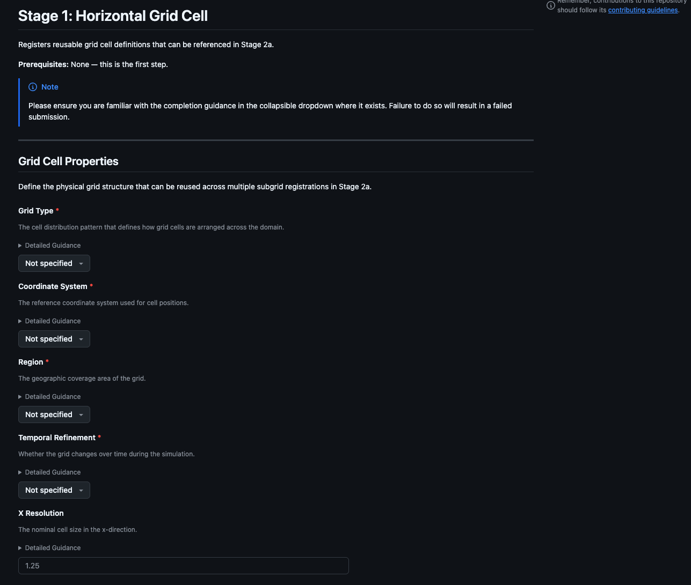
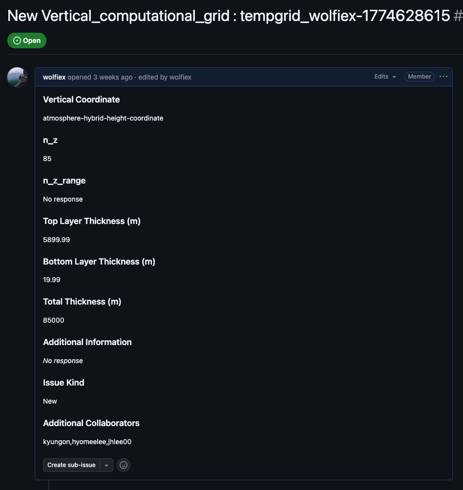
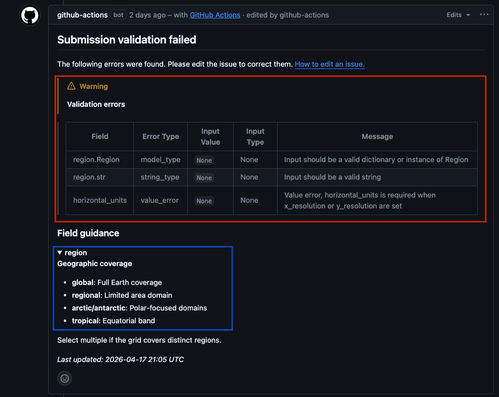
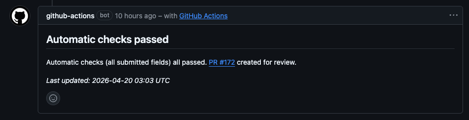
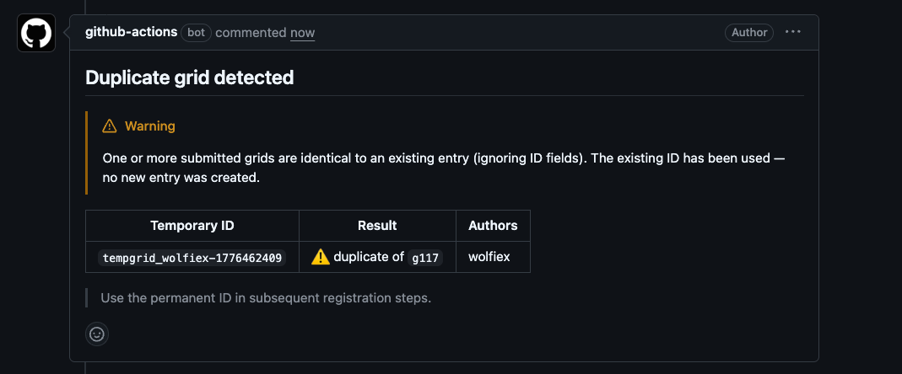
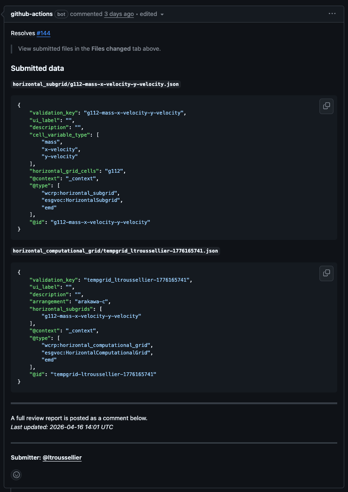
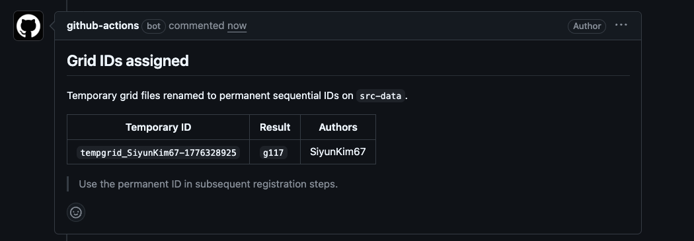

# What to Expect on Submission

This page describes what you will see at each stage of the submission process and hilights some points of what you need to do next.

---

## Step 1 — Open the Form

Log into GitHub and go to the [submission form chooser](https://github.com/WCRP-CMIP/Essential-Model-Documentation/issues/new/choose) and select the form for the current stage. The [Submission Guide](Submission-Guide/) describes which form to use and in what order.

Each form opens as a structured GitHub issue. Fill in the fields, read the collapsible guidance (▶)!, and then submit.

### This generates an issue with your submitted information

---

## Step 2 — Automated Validation

On submission a workflow action proceses your information and tries to create the relevant files. It also performs a number of rudamentary checks on the information provided. After a couple of minutes you will get one of the following commented on your submission.

**If validation fails**, a comment is posted on your issue it should explain exactly which fields need correcting. No pull request is created as the User will need to to make these changes first.. Edit the issue body to fix the problems — the action re-runs automatically on every edit, so there is no need to close and reopen the issue. Repeat until the comment reports a clean result.

**If validation passes**, the action creates a JSON record and opens a pull request targeting the `src-data` branch. A comment on your issue links directly to the new PR.

!!! note Editing the issue body at any point — before or after the PR is created — re-runs the action and updates the PR with fresh content. You do not need to create a new issue to make a correction.

---

## Step 3 — The Pull Request and its Report

The pull request the action opens contains two things:

- the diff (a single JSON file showing the data that will be added to the registry) and
- a summary report posted as a PR comment.

The report shows the file created from your submission. If we are submitting groups a temporary ID will be assigned to the record (e.g. `tempgrid_username-1234`), and a link back to the originating issue. Additionally for grids we will also run a duplicate check, comparing your submission against all existing records and posts a comment if a match is found.

!!! warning The duplicate warning is advisory only — it does not block the submission. You and the reviewer should read the comment and decide whether your record is genuinely distinct. If it duplicates an existing entry, you can withdraw by closing the issue (which also closes the PR automatically) and reference the existing ID in your next stage instead.

The PR is also added to the [Reviewer Project Board](https://github.com/orgs/WCRP-CMIP/projects/8) and the `needs-review` label is applied to your issue. You can track all your open submissions from the [My Issues](https://github.com/WCRP-CMIP/Essential-Model-Documentation/issues?q=is%3Aissue+author%3A%40me) link.

---

## Step 4 — First Review

A reviewer reads the pull request — examining the JSON diff and the summary report — and either approves, requests changes, or leaves a comment. See [Review Options](../Reviewer_Gudance/Review_Options/) for a full explanation of what each action means.

Any feedback is automatically copied as a comment on your original issue. A note pointing you to the PR thread is added alongside it in case you want to reply.

If the reviewer **requests changes**, your issue receives a `changes-requested` label. Edit the issue body with the corrections — the action re-runs and the PR updates automatically. Once you save, a `changes-made` label is added so the reviewer knows to look again. See [When Things Go Wrong](../When_Things_Go_Wrong/) if you are unsure what a change request means.

Once the reviewer is satisfied they approve the PR. This removes the `needs-review` label from your issue and moves the PR to the *Done* column on the project board.

!!! note You can see all PRs that have been approved and are waiting to merge at the [already-reviewed filter](https://github.com/WCRP-CMIP/Essential-Model-Documentation/pulls?q=is%3Apr+is%3Aopen+-label%3Aneeds-review+review%3Aapproved).

---

## Step 5 — Second Review and Merge

A second reviewer or maintainer performs a final sanity check and then triggers the merge. Once merged, the PR is incorporated into `src-data` and will appear on [emd.mipcvs.dev](https://emd.mipcvs.dev).

---

## Step 6 — Publication and ID Assignment

Once merged, a publication pipeline runs automatically:

1. The new record is synced to the `production` branch and your temporary ID (`tempgrid_*`) is replaced with a permanent one (e.g. `g112`).
2. Linked-data graph files are regenerated.
3. The documentation site is rebuilt and deployed to GitHub Pages.
4. Issue form dropdowns are updated so the new ID is available for selection in subsequent stages.

This takes a short while. Your permanent ID will appear in the relevant form dropdowns by the next time the templates are regenerated (daily, or after the next publication run). This will also be posted on both the pull request and original issue (submission).

---
