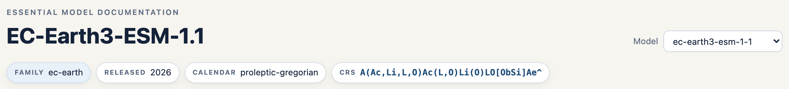
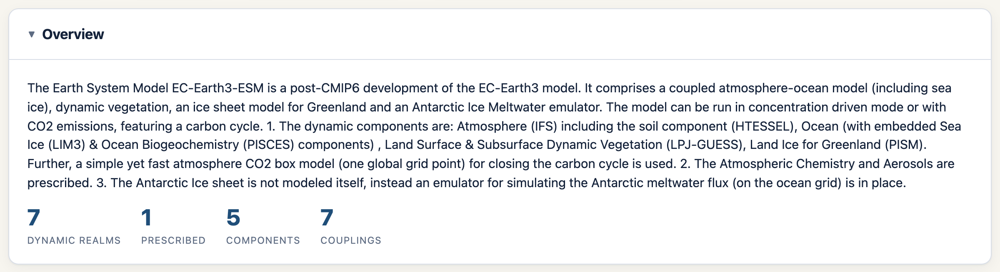
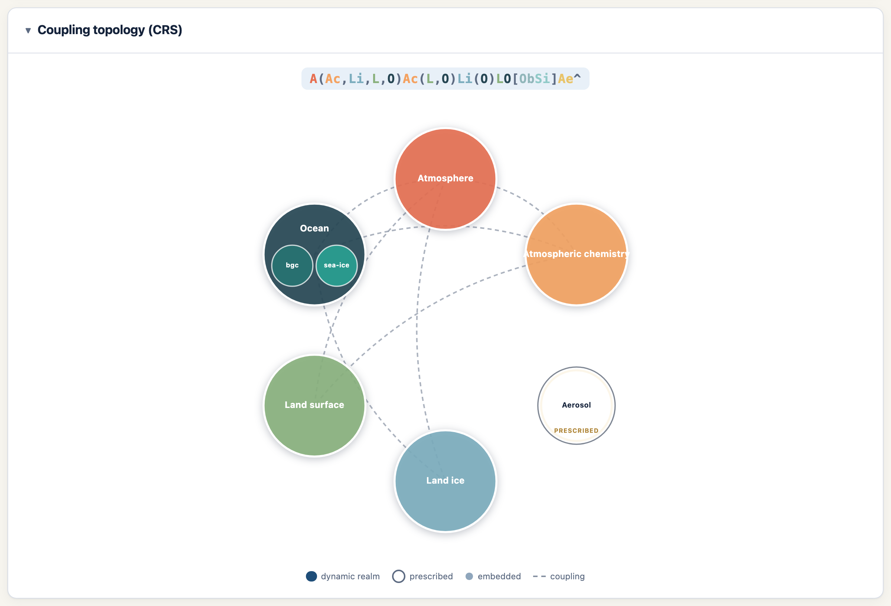
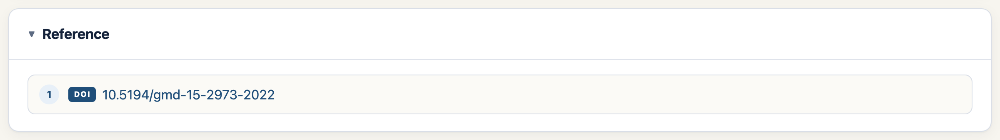
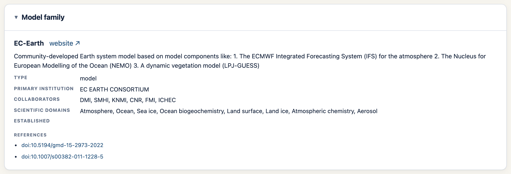
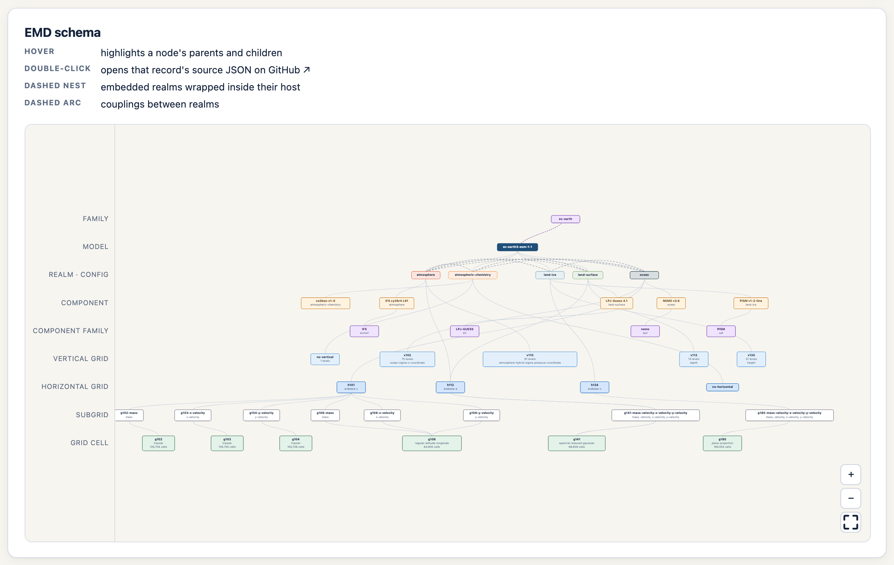
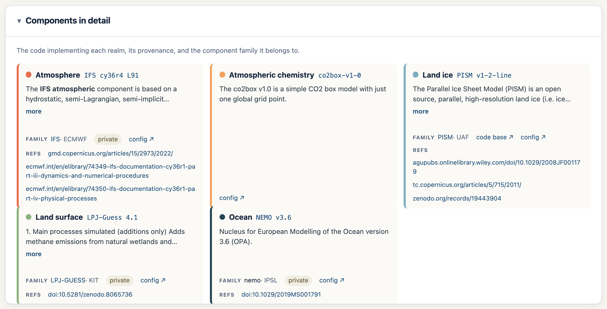
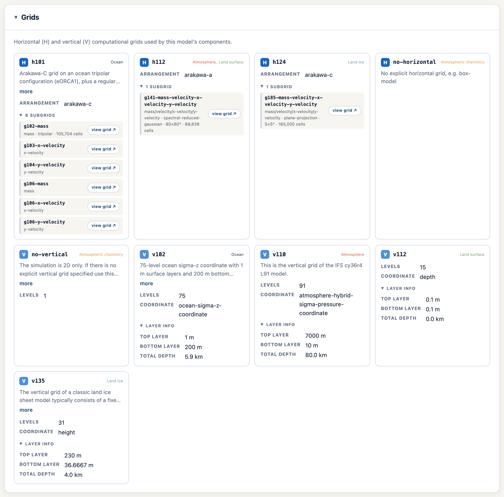

# EMD Model Page — Features & How to Use

---

## 1. Header & model picker

The header shows the model's display name and a row of quick-fact chips: **family**,
**release year**, **calendar**, and the raw **CRS** string. The **Model** dropdown on
the right switches models; the URL updates so the view is shareable, and browser
back/forward work.

---

## 2. Overview

A plain-language description of the model followed by some basic **statistics**: how many
dynamic realms, prescribed realms, omitted realms, components, and couplings it has.

Descriptions are rendered from Markdown, so links and emphasis display properly.

---

## 3. Coupling topology (CRS)

This is a picture of how the model's realms fit together.

**The coloured CRS string** at the top links each realm code with its realm colour.
Embedded realms are inside the `[…]` and coupled realms are neighboured following the design tactics of the crs.

**The diagram** is generated from the crs string:

- **Dynamic realms**: filled circles arranged on a ring.
- **Embedded realms**: the small circles packed *inside* a parent circle.
- **Prescribed realms** (external, one-way forcing) are drawn smaller, unfilled, with
  a faint double ring and a "prescribed" label 
- **Couplings** are the dashed arcs between realms. 

---

## 4. References

Every reference on the model record gets its own card — a numbered badge plus a
**DOI** badge and link where available, or the citation text for free-form entries.
These will be resolved using the data cite information and improved. 

---

## 5. Model family

The family the model belongs to: type, primary institution, collaborators, scientific
domains, year established, programming languages, licence, and **website / source**
links, plus any family-level references. This helps give us an understanding of where this specific model is coming from. 

---

## 6. EMD schema (interactive graph)

A tiered, force-directed graph of the *entire* record and everything it links to.

This is generated by following the links from the source_id all the way until the individual grids and provides a good representation of how the EMD is defined in the background any all the submissions that go into creating a source id. 

How to use it:

- **Hover a node** to spotlight its parents, children, and coupling partners.
- **Double-click a node** to open that record's source JSON on GitHub in a new tab.
- **Drag** a node to reposition it; **scroll** to zoom, **drag the background** to pan.
- Use the **+ / − / fit** buttons (bottom-right) to zoom or re-fit the whole graph.
- Dashed boxes ("nests") wrap embedded realms inside their host; dashed arcs mark
  couplings.

---

## 7. Components in detail

One card per realm, detailing the component that describes it. Component information such as description, reference and code base are also provided. 

---

## 8. Grids

One card per distinct grid the model uses:

- An **H / V badge** marks horizontal vs vertical grids, next to the grid id.
- The **realm(s) that use the grid** are listed as small realm-coloured, comma-
  separated tags. These help identify where the grids are being used for this specific source_id. 
- **Horizontal grids** have an expandable **subgrids** list. Each subgrid row shows its
  variable type, grid type, resolution and cell count, plus a link to the grid for those requifing more information. 
- **Vertical grids** show levels and coordinate, with layer thicknesses (top / bottom /
  total depth) hidden in a collapsible **"Layer info"** box - similar to the subgrids for the horizontal.

---

## 9. Model record (JSON)

![Raw JSON viewer with Simple/Resolved toggle and copy button]

The raw JavaScriptObjectNotation record, syntax-highlighted, always at the bottom of the page. Use the
**Simple ⇄ Resolved** toggle to switch between the record as defined in the model file, or a recursively populated version going all the way until the horizontal-grid-cell level.  The **Copy** button copies whichever view is showing.

