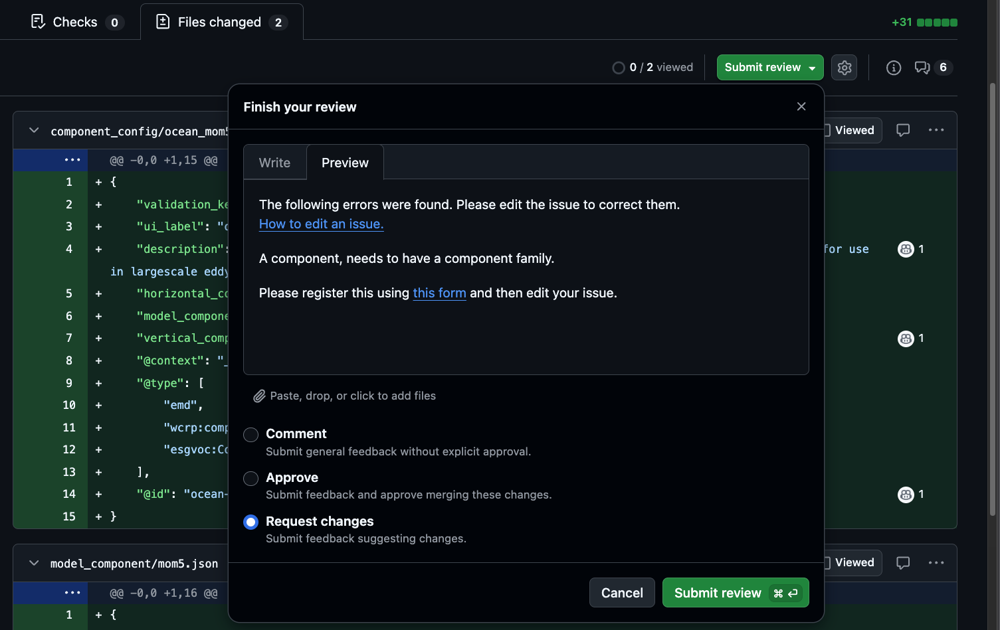

# Writing Review Comments
Scientific reviewers are there to comment on the feasibility of submissions once domain-specific knowledge has been applied. The aim is not to interrogate the submitters, but more to ensure there are no mistakes present, which can have implications further down the EMD / publication chain. 

This page contains some guidance on how to respond. 

> [!WARNING]
> This page is a work in progress, if it can use improvements, please submit a pull request

> [!CAUTION]
> *Pull request reviews to happen in the review panel - (suggest changes)*
    If you accept copilot reviews or edit the branch, this will update a pull request. However updating the issue body afterwards will re-run the generation scripts and superseed these changes. 


---
> [!IMPORTANT]
> *Note on direct branch edits* (avoid))
    If you accept copilot reviews or edit the branch, this will update a pull request. However updating the issue body afterwards will re-run the generation scripts and superseed these changes. 


## Commenting and review procedure. 

### Minor corrections
If the fix before merging is minor, e.g. a typeographical mistake of the order `noo -> No`, then administrators and maintainers of the repository should be able to edit the original issue body and let the workflow automation regenerate the corrected content before approving. Do not rewrite sections by the submitter! This reduces the work and latency between correction and merging. 

### Changes
If there are changes that can improve the submission, you can suggest an alternative in the comments, and then it is up to the submitter to accept or reject these. We will wait for their response before continuing. 

### Scientific / Form corrections: 
Unless it is an issue with the generation script, these changes fall solely on the submitter to approve, and ideally implement. This includes corrections of a dropdown item, or forgetting to fill a pre-required field. 

### No changes


If you find nothing to flag, write something along the lines of 

```markdown
**EMD Review:** No issues found.
```
or `All looks good to me`


---
### Wording of suggested edits 


#### All edit requests should start with 
```md
The following errors were found. Please edit the issue to correct them. 
[How to edit an issue.](https://scribehow.com/embed-preview/Edit_an_Issues_Description_Field_on_GitHub__BFQ9OA50Q9-RbQvQ3r_GEQ?as=slides&size=flexible)
```

#### Additional information 
```md
A component, needs to have a component family. 

Please register this using [this form](https://github.com/WCRP-CMIP/Essential-Model-Documentation/issues/new?template=model_component.yml) and then edit your issue. 
````


---

## GitHub Alert Syntax

If we really need to emphasise a point we can use the alert syntax within comments. 

```markdown
> [!IMPORTANT]
> Critical information required for a correct submission.
```

These render as coloured callout boxes in the GitHub UI. Plain blockquotes (`>`) without the keyword render as standard indented quotes and carry no visual weight — use the typed form for review comments.

---


---

## Requesting Edits from Submitters


When changes are needed, leave the request on the **request changes** part of the PR. 

The action on the submitter is to edit the issue body and then the action will re-runs automatically, updating the PR.

Make it easy to understand — include exactly what to change, in which field, and what the corrected value should be:

```markdown
Please update the **original issue** (not this PR) with the following correction:

- Field: `x_resolution`
- Current value: `"1.4 km"`
- Corrected value: `"1.40"` (units are set separately in the `units` field)

After editing the issue body, the pull request will update automatically within a few minutes.
```

Link to the [edit guide](https://scribehow.com/embed-preview/Edit_an_Issues_Description_Field_on_GitHub__BFQ9OA50Q9-RbQvQ3r_GEQ?as=slides&size=flexible) if the submitter may be unfamiliar with the process.

---

## Other Useful Markdown

**Inline code** — use backticks to reference field names, values, and IDs:

```markdown
The `n_cells` value of `55296` is consistent with a global 1.25° × 0.9° grid.
```

**Quoting the submission** — quote the relevant line from the diff to anchor your comment:

```markdown
> "description": "This is the grid used in our model."

This description references the model rather than the grid itself.
Leave blank or replace with a description of the grid's physical structure.
```

**Linking to a specific line in the diff** — in the PR Files tab, click a line number to highlight it, then copy the URL. Paste this into your comment to pin it to the exact field being discussed. This is especially useful when requesting changes to a specific value in a long JSON file.
