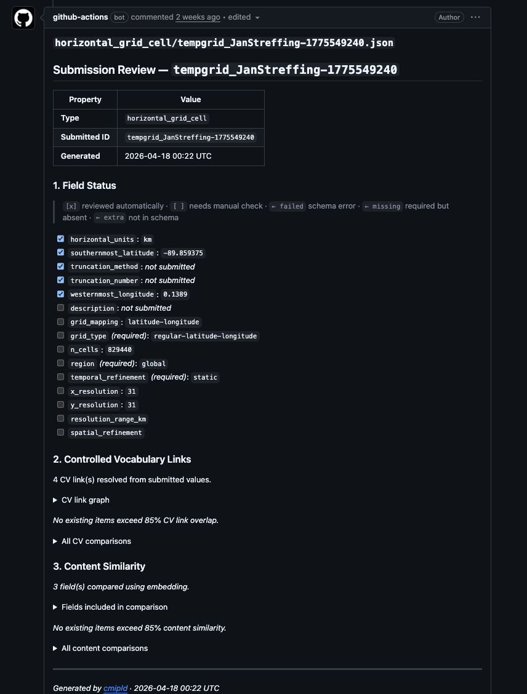
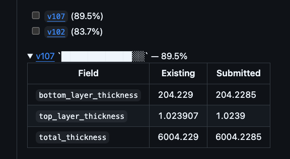
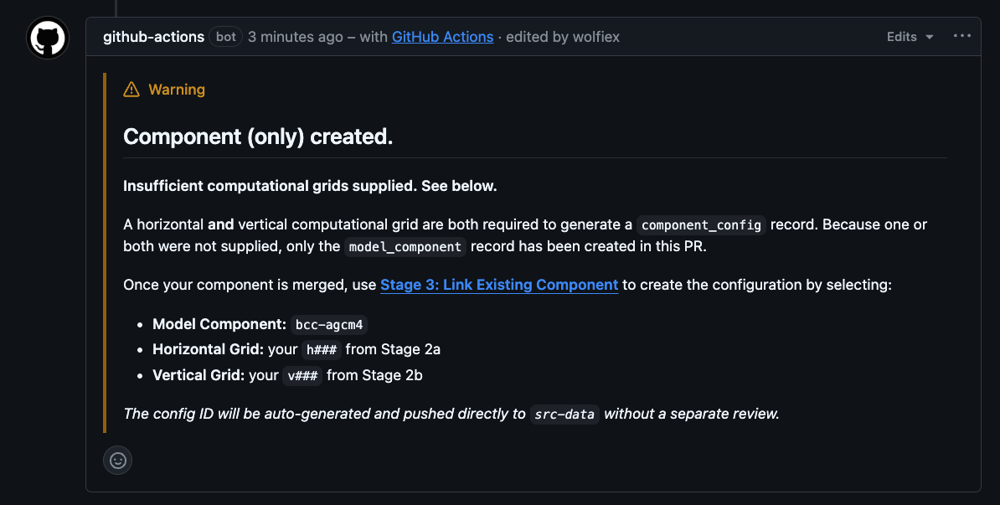

# Interpreting the Review Summary

Every pull request generated by a new or edited EMD submission includes two automated bot comments:

1. **Automatic checks passed** — posted to the original issue. Confirms validation passed and links to the PR.
2. **Review report** — posted to the pull request. This is the document described on this page.

The review report is generated by the EMD processing pipeline and is intended for reviewers only. Submitters will not see it unless they navigate to the PR directly.

The PR body also shows the submitted JSON data for each file created, so you can see the raw content without opening the diff:

---

## Structure of the Report

The report has three numbered sections.

### Section 1 — Field Status

A checklist of every field defined in the EMD schema for this record type. Each field is listed with one of the following states:

| Symbol | Meaning |
|--------|---------|
| `[x]` | Field was checked automatically by the validator |
| `[ ]` | Field is present but has no automatic validator — review manually |
| `← failed` | Validator ran and found an error |
| `← missing` | Required field was not submitted |
| `← extra` | Field was submitted but is not in the schema |

Fields marked `← missing` must be corrected before the record can be approved. Fields marked `← extra` are usually harmless but should be noted.

Metadata fields (`ui_label`, `validation_key`, `alias`) are hidden from this section — they are managed automatically and do not need manual review.

### Section 2 — Controlled Vocabulary Links

This section resolves any submitted values that reference a controlled vocabulary (CV) or another EMD folder entry, and presents them as clickable links.

**Score line** — e.g. `Checking that linked files resolve: 3/4 (75%)`. This tells you how many of the CV-linked fields in the submission resolve to a known registered value. A score below 100% means at least one submitted value did not match any entry in the relevant CV.

**Graph** — a Mermaid diagram showing the submitted record connected to all linked values. For horizontal grid submissions, subgrid nodes expand to show their linked grid cell and variable types. Nodes are clickable links to the relevant CV or EMD registry entry.

**Similarity table** — if any existing entries share a high proportion of the same CV links (≥ 85% by default), they are listed here with a percentage overlap. This is the primary duplicate-detection tool.

!!! warning "Similarity does not mean identity"
    A high similarity score flags a candidate duplicate, not a confirmed one. Always compare the full records before making a decision.

### Section 3 — Content Similarity

Compares the free-text and numeric fields against all existing records of the same type. Items above the similarity threshold are listed with a per-field diff in a collapsible details block.

Expand these details blocks to see exactly which fields differ and whether the difference is meaningful.

---

## Common Scenarios

### All green, no similar entries

The submission is straightforward. Check the raw JSON diff for formatting issues, then approve.

### Submission validation failed before review

If the submitter's issue contained errors, validation fails before a PR is created and the following is posted to the issue instead of the review report:

The submitter must edit their issue to correct the listed errors. The workflow re-runs automatically on every edit.

### Missing required field (`← missing`)

Request changes. Quote the field name and tell the submitter what value is expected. Use the [Review Comments](Review_Comments.md) templates.

### CV link below 100%

One of the dropdown values does not match a registered CV entry. Check the field in the diff, identify the correct value, and request a correction.

### High similarity to an existing entry — possible duplicate

Check the similarity table in the report. Open the linked existing record and compare:

- Are the resolution, topology, or cell count different? → New record may be valid.
- Is the only difference a description or label? → Likely a duplicate. Request the submitter use the existing ID.
- Are all structured fields identical? → Reject as duplicate.

When a PR is merged and the content exactly matches an existing entry, the rename workflow detects this and uses the existing ID automatically rather than creating a new one.

For new (non-duplicate) submissions, the temporary `tempgrid_` ID is replaced with a permanent sequential `g###`, `h###`, or `v###` ID on merge.

### Component-only warning

If a model component was submitted without both a horizontal and vertical grid, the component record is created but no `component_config` is generated:

This is not a reason to reject the PR. The component record itself is valid. The submitter will need to use [Stage 3: Link Existing Component](https://github.com/WCRP-CMIP/Essential-Model-Documentation/issues/new?template=link_existing_component.yml) once the PR is merged to create the configuration.

### `reviewer-comment` label present

A previous reviewer left a comment review without blocking or approving. Read that comment on the issue thread before completing your own review — they may have flagged something needing a decision.

### `changes-requested` + `changes-made` labels present

The submitter has responded to a prior change request. Focus your re-review on the fields that were originally flagged.

### `changes-requested` + `approved` labels present

A reviewer approved after changes were made. Perform a final sanity check and merge if satisfied.

---

## What the Report Does Not Cover

- **Scientific validity** — the automated report checks structure and vocabulary, not scientific correctness. Domain expertise is always required.
- **Description quality** — the report flags that a description exists, but cannot assess whether it is meaningful. Read it.
- **External link health** — the report does not check whether URLs in reference fields resolve. Follow them manually.
- **Duplicate detection beyond merged entries** — the similarity check only covers records already on `src-data`. A submission may duplicate a PR still in review. Check the open PR queue if in doubt.
