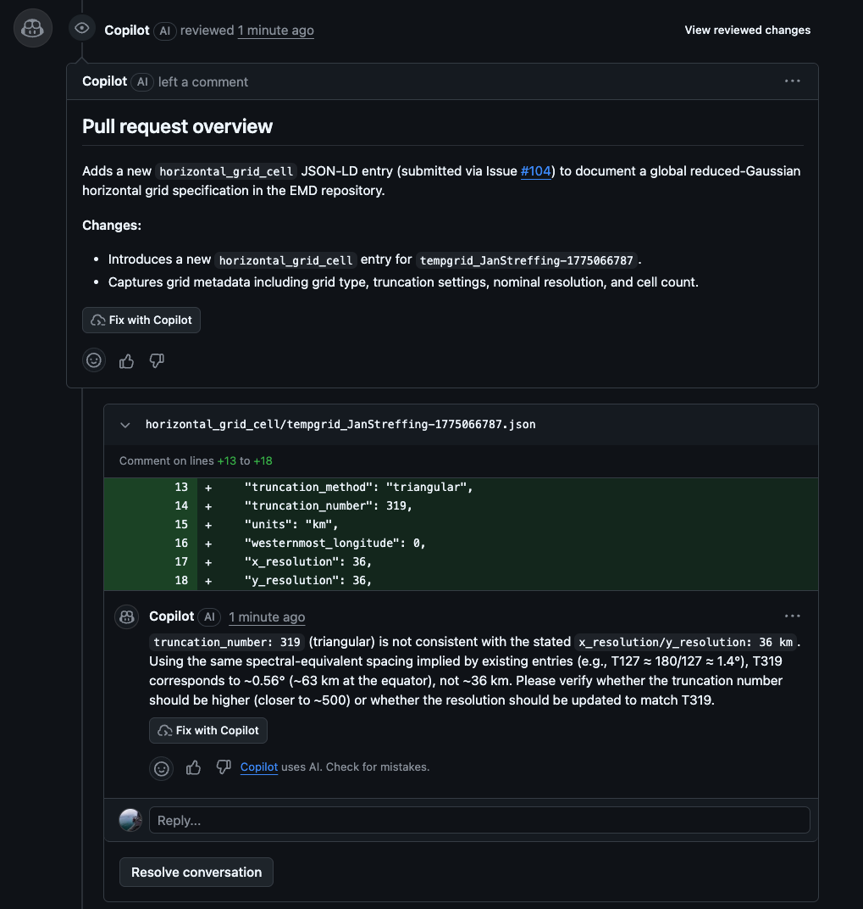
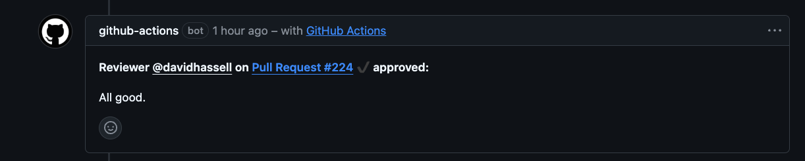
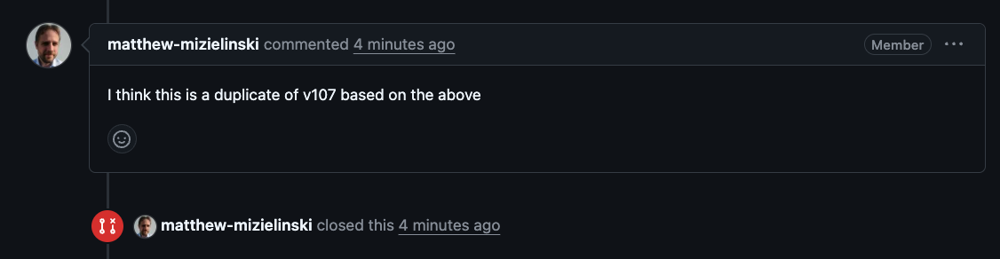

# Review Options

When you finish reading a pull request on GitHub, you submit your assessment using the **Review** panel. There are three options: **Approve**, **Request Changes**, and **Comment**. This page explains what each one means, when to use it, and what happens automatically when you do.

---

## How to Open the Review Panel

1. Open the pull request.
2. Click the **Files changed** tab.
3. Click the green **Review changes** button (top right).
4. Write your summary comment (optional but encouraged).
5. Select your review type and click **Submit review**.

!!! note
    All review feedback must go through this panel. Comments left directly on the **Conversation** tab of the PR, or on the original issue, are not formal reviews and do not trigger the automated label and notification workflow.

---

## Inline Line Comments

Before submitting your overall review you can attach comments to specific lines in the diff. These are threaded directly on the file and line in question and are the most precise way to flag a particular field value.

**To leave an inline comment:**

1. In the **Files changed** tab, hover over the line you want to comment on — a blue **+** button appears on the left margin.
2. Click **+** to open an inline comment box on that line.
3. Write your comment.
4. Click **Start a review** (not *Add single comment*) — this queues the comment as part of your review rather than posting it immediately as a standalone message.
5. Continue adding inline comments on other lines as needed.
6. When finished, click **Review changes** and submit with your overall assessment.

Inline comments submitted as part of a review are automatically mirrored to the linked issue, with the filename and line number included for context. Standalone comments posted outside a review (via *Add single comment*) are **not** mirrored.

!!! tip
    Use inline comments for field-specific feedback — e.g. flagging that `truncation_number` is inconsistent with `x_resolution`. Use the overall review body for a summary conclusion.

---

## The Three Options

### ✔ Approve

Use when the submission is scientifically valid and ready to merge as-is, or with only trivial corrections that you have already made or that a maintainer can apply directly.

**What happens automatically:**

- The PR receives an `approved` label.
- The `needs-review` label is removed from the linked issue — the submitter can see their submission has passed.
- The `changes-made` label is removed if present.
- The PR moves to the **Done** column on the [reviewer project board](https://github.com/orgs/WCRP-CMIP/projects/8).
- Your review body (if you wrote one) is copied as a comment to the original issue so the submitter sees your feedback.
- A follow-up note is added to the issue pointing the submitter back to the PR thread for any replies.

A second reviewer or maintainer then performs a final sanity check and merges.

---

### ✖ Request Changes

Use when there are corrections the submitter must make before the record can be approved. Always include specific, actionable guidance — what to change, in which field, and what the correct value should be.

**What happens automatically:**

- The PR receives a `changes-requested` label.
- The `changes-made` label is removed if present (resetting the cycle).
- Your review body is copied as a comment to the original issue.
- A follow-up note is added to the issue pointing the submitter to the PR for replies.

**What the submitter must do:**

Edit their original issue body with the requested corrections. The issue processing action re-runs automatically on every edit and updates the PR. Once they have made their changes, the `changes-made` label is added to both the issue and the PR so reviewers know to take another look.

!!! tip
    Leave your change requests on the **Request changes** review, not as free-form issue comments. This ensures the automated label flow works correctly and the submitter receives a clear notification.

---

### — Comment

Use when you want to leave observations or ask questions without formally blocking or approving the submission. Suitable for flagging a potential concern for a second opinion, or for noting something that does not require immediate action.

**What happens automatically:**

- The PR receives a `reviewer-comment` label.
- The linked issue also receives the `reviewer-comment` label so it surfaces in filtered views.
- Your review body is copied as a comment to the original issue.

This option does not change the submission's review status — it remains in the review queue. Use `needs checking` label alongside this if you want to explicitly signal that another reviewer's input is required before a decision.

---

## Label Summary

| Review action | Label added | Labels removed |
|---|---|---|
| Approve | `approved` | `needs-review`, `changes-made` |
| Request changes | `changes-requested` | `changes-made` |
| Comment | `reviewer-comment` | — |
| Submitter edits issue (after `changes-requested`) | `changes-made` | — |

---

## Closing a Submission

Closing is done on the **issue**, not the pull request.

If a submission is a duplicate of an existing entry, is out of scope, or the submitter requests withdrawal:

1. Navigate to the original issue.
2. Leave a comment explaining why the submission is being closed.
3. Click **Close issue** at the bottom of the conversation.

This automatically closes any linked pull requests (those with `Resolves #N` in their body) and removes the PR from the review queue. The submitter is notified and can reference the existing registry ID in their next submission stage.

!!! warning
    Do not close the pull request directly. Closing the issue is the correct action — it triggers the linked-PR closure workflow and ensures the project board is updated correctly.
