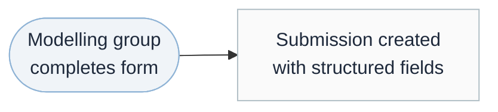
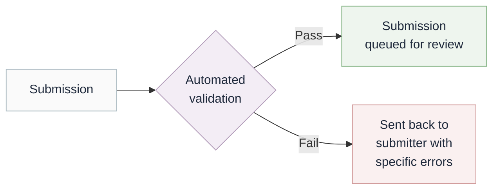
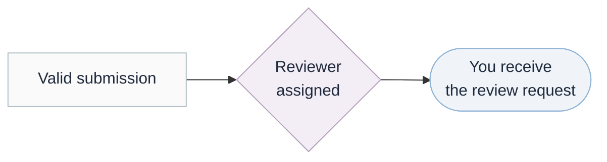
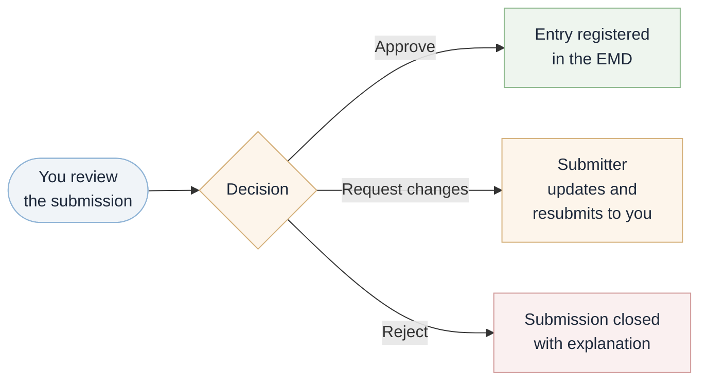

# EMD Reviewer Guide

!!! tip "Who?"
    This guide is for vetted community members interested in helping to review an EMD submission. It explains how submissions reach you, what has already been checked, what needs your judgement, and how to record your decision.

---

## Overview

EMD entries are submitted through online forms. Before a submission reaches you it passes through automated validation. Your role is to assess the scientific content that machines cannot judge — whether the description is accurate, the component classifications are sensible, and the entry is not a duplicate.

---

## How submissions reach you

### Step 1: Submission

A modelling group fills in a structured form on GitHub. No programming or Git knowledge is needed.

### Step 2: Automated validation

The submission is checked against the EMD schema. If anything is missing or incorrectly formatted, the submitter is asked to correct it. Only valid submissions proceed further.

### Step 3: Review assignment

A reviewer is selected based on scientific domain, independence from the submitting group, and current workload. The reviewer (you) is notified via the pull request.

### Step 4: Your decision

You review the flagged items and choose one of three actions: approve, request changes, or reject.

---

## What has already been checked

By the time a submission reaches you, the following have been verified automatically. You do not need to re-check these.

| Check | What was tested |
|---|---|
| **Required fields** | All mandatory fields are present and correctly formatted |
| **Unique identifier** | The proposed ID does not clash with any existing entry |
| **Cross-references** | Any referenced grids, families, or components exist in the registry |
| **Published references** | DOI links are valid and reachable |
| **Controlled vocabularies** | Values such as grid types, calendar types, and arrangements match the accepted lists |
| **Numeric plausibility** | Values such as layer counts, resolutions, and release years fall within expected ranges |

---

## What needs your judgement

The review report on the pull request highlights the items below. These require scientific expertise that automated checks cannot provide.

**Description quality** — Is the scientific description accurate and informative? For models, does it mention all component types (dynamically simulated, prescribed, and omitted)? Would a researcher unfamiliar with this model understand what it does from the description alone?

**Naming conventions** — Does the name follow the patterns used by other entries of the same type? For models, is the `source_id` consistent with CMIP naming expectations?

**Potential duplicates** — A similar entry may have been flagged. Is this genuinely a new entry, or should the submitter be updating an existing one?

**Component completeness** — For model submissions: do the dynamic, prescribed, and omitted component assignments together account for all the scientific domains expected for this type of model? Is anything missing or misclassified?

**Scientific plausibility** — Do the values make sense as a whole? For example: a 1 km resolution global ocean grid would be unusual; a land-only model that omits the land surface component would be contradictory; a release year before the model family was established would be inconsistent.

---

## Recording your decision

Take one of the following actions directly on the pull request.

**Approve** — Use the GitHub review interface to approve. The entry is registered immediately and appears on the EMD site within minutes.

**Request changes** — Leave review comments explaining what needs to change. Be specific: name the field, state the problem, and suggest a correction where possible. The submitter is notified and may update the submission, which then returns to you.

**Reject** — Close the pull request with a written explanation. The submitter may open a new submission after addressing the concerns.

---

## Practicalities

You were assigned because your expertise or interests matche the submitted content. You have **4 days** to respond before the review is automatically reassigned. If you have a conflict of interest or are unable to review, reassign the pull request to another reviewer via the assignee field.

Once you approve and the entry is merged:

- The entry appears on the EMD github within a few minutes.
- Other submitters will then be able to reference it in their own submissions within the next few hours (for example, selecting a registered grid or model family from a dropdown).
- For model submissions, the `source_id` will need to be linked in the dropdown in CMIP7 controlled vocabularies. This will automatically be accepted. 
