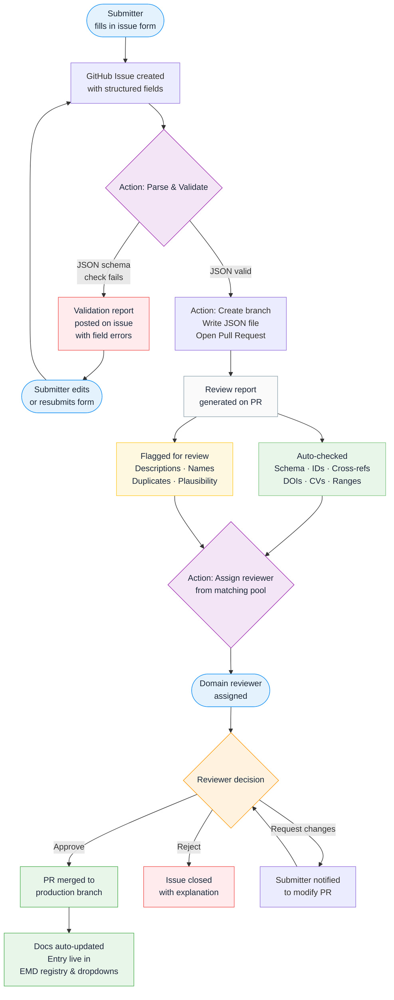

# Essential Model Documentation

The **Essential Model Documentation (EMD)** provides a standardised, machine-readable description of Earth system models for CMIP7 and beyond. It captures exactly the information a scientist needs to understand how a model was configured without imposing unnecessary documentation burden on modelling groups.

**[Submit a model ->](https://github.com/WCRP-CMIP/Essential-Model-Documentation/issues/new?template=model.yml)** &nbsp;·&nbsp; [Submission guide](01_submission-guide.md) &nbsp;·&nbsp; [Browse the registry](1_Explore_The_EMD/Models/)

---

## Why EMD?

Model output is only useful if users understand how it was produced. Comprehensive documentation is time-consuming to write, and inconsistent formats make cross-model comparison difficult. EMD solves this by defining a **minimal but sufficient** set of metadata covering:

- The top-level model and its CMIP `source_id`
- Each model component what is dynamically simulated, prescribed, or omitted
- The computational grids used by each component
- The model family and development institution(s)

For CMIP7, EMD registration is **mandatory** ensuring every participating model has consistent, comparable documentation from day one.

---

## How a Submission Works

Submissions are made through **GitHub issue forms** no Git knowledge required. Once submitted, an automated pipeline handles validation, review assignment, and registration.

---

## Automated Checks

When your issue is parsed, the following checks run automatically. Results are posted directly on the pull request.

### Automatically verified

| Check | What is tested |
|---|---|
| **Schema validity** | All required fields are present and correctly typed |
| **ID uniqueness** | The proposed ID does not clash with an existing entry |
| **Cross-references** | Referenced IDs (grid IDs, family IDs, component configs) resolve to real entries |
| **DOI reachability** | Reference DOI URLs return a valid HTTP response |
| **Controlled vocabulary** | Dropdown values match the registered CVs (grid types, arrangements, calendars, etc.) |
| **Numeric ranges** | Values like `n_z`, `x_resolution`, release year are within plausible bounds |

### Flagged for human review

These items cannot be automatically verified and are highlighted in the review report for the assigned reviewer:

| Flag | Reason |
|---|---|
| **Description quality** | Free text checked for length and completeness, but scientific accuracy requires human judgement |
| **Name conventions** | Naming patterns vary across modelling groups; a reviewer confirms consistency |
| **Potential duplicates** | Similar entries detected reviewer confirms whether this is truly new or a modification |
| **Component completeness** | Whether dynamic/prescribed/omitted assignments cover all expected domains for this model type |
| **Scientific plausibility** | e.g. a 1 km global ocean grid, or a land-only model with no land surface component |

---

## Review Assignment

Once the pull request is opened, an action automatically assigns a reviewer from the **EMD reviewer pool**. Assignment is based on:

- **Scientific domain** atmosphere, ocean, land surface, sea ice, etc. matched to the submission type
- **Institutional affiliation** preference for reviewers independent of the submitting group
- **Current workload** reviewers with fewer open assignments are prioritised

Reviewers are CMIP community scientists who have volunteered for the pool. The assigned reviewer is tagged on the PR and has 14 days to respond before escalation.

---

## Reviewer Actions

The reviewer examines the flagged items and the auto-check report, then takes one of:

| Action | Outcome |
|---|---|
| **Approve** | PR is merged; entry enters the registry; docs update automatically within minutes |
| **Request changes** | Reviewer leaves specific comments; submitter is notified to update the PR |
| **Reject** | Issue is closed with a written explanation; submitter may open a new issue after addressing the concerns |

---

## After Registration

Once merged to the production branch:

1. The JSON file is written to the vocabulary directory
2. The docs build runs automatically the entry appears on this site within ~5 minutes
3. The entry becomes available in issue form **dropdowns** for other submitters to reference
4. The `source_id` (for models) is officially registered in the CMIP7 CVs

---

## Start a Submission

| What you're registering | Form |
|---|---|
| Grid cells & subgrid geometry | [Stage 1 Grid Cells & Subgrid](https://github.com/WCRP-CMIP/Essential-Model-Documentation/issues/new?template=horizontal_grid_cells.yml) |
| Horizontal computational grid | [Stage 2a Horizontal Grid](https://github.com/WCRP-CMIP/Essential-Model-Documentation/issues/new?template=horizontal_computational_grid.yml) |
| Vertical computational grid | [Stage 2b Vertical Grid](https://github.com/WCRP-CMIP/Essential-Model-Documentation/issues/new?template=vertical_computational_grid.yml) |
| Model or component family | [Family](https://github.com/WCRP-CMIP/Essential-Model-Documentation/issues/new?template=model_family.yml) |
| Model component | [Stage 3 Model Component](https://github.com/WCRP-CMIP/Essential-Model-Documentation/issues/new?template=model_component.yml) |
| Complete model (source_id) | [Stage 4 Model](https://github.com/WCRP-CMIP/Essential-Model-Documentation/issues/new?template=model.yml) |

Not sure where to start? See the [full submission guide](01_submission-guide.md).

Track your open submissions: [My Issues ->](https://github.com/WCRP-CMIP/Essential-Model-Documentation/issues?q=is%3Aissue+author%3A%40me+is%3Aopen)
