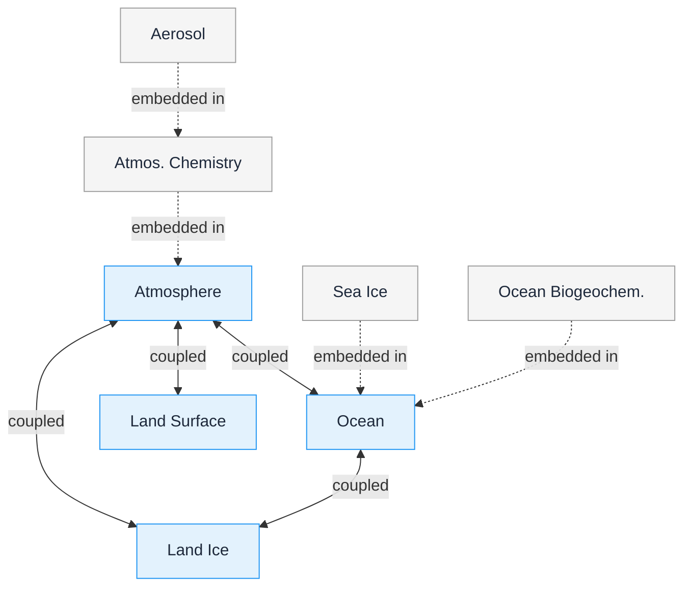

# Essential Model Documentation

The Essential Model Documentation (EMD) is a high-level description of an earth system model. It is intended to contain information about model configuration that may be helpful to the communities who expect to make use of the model output, whilst not imposing burdensome requirements on those providing the data.

It is not intended to contain all information about a model. More detailed model documentation than that provided by the EMD should be found in the references cited as part of the EMD, or from other external sources.

The EMD has been designed to be applicable to any earth system model. It was originally developed for use within the [CMIP7](https://wcrp-cmip.org) project ([Dunne et al., 2025](https://doi.org/10.5194/gmd-18-6671-2025)), for which EMD registration is a mandatory requirement for model participation. A model cannot be assigned a CMIP7 `source_id` unless its EMD has been provided and accepted.

The EMD is defined by a versioned [specification document](https://doi.org/10.5281/zenodo.17853724) maintained by the [CMIP7 MIP Controlled Vocabularies Task Team](https://wcrp-cmip.org/cmip7-task-teams/cvs/).

## Structure

The EMD is collected for the model as a whole (the top-level model), and for each of the model's dynamically simulated components.

A **top-level model** is described by its name, model family, calendar, release year, references to published work, and the classification of its components as dynamically simulated, prescribed, or omitted. For CMIP7, the model name is registered as the `source_id`.

A **model component** describes an individual part of the top-level model that dynamically simulates a set of physical processes. Eight component types are defined: aerosol, atmosphere, atmospheric chemistry, land surface, land ice, ocean, ocean biogeochemistry, and sea ice. Each dynamic component is described by its name, family, scientific overview, references, code location, and its relationships with other components.

A **computational grid** describes the mesh on which a model component is integrated. The horizontal grid records the staggering arrangement, grid type, resolution, region, and coordinate reference system. The vertical grid records the coordinate type, number of layers, and layer thicknesses.

## Component relationships

All dynamically simulated components within a top-level model interact with each other either directly or indirectly. The EMD identifies which components directly interact, characterising each as either "embedded in" or "coupled with" other components.

An **embedded** component is tightly integrated within a host component, typically sharing its grid and code base. An embedded component has a single host, which may itself be embedded in another host, forming a hierarchy. An embedded component cannot also be coupled with any other components.

A **coupled** component exchanges quantities with other components at regular intervals, such as fluxes of mass, energy, and momentum. Coupling is symmetrical: if component A is coupled with component B, then B is also coupled with A. Only superior host components — those at the top of an embedding hierarchy — may be coupled with each other.

*The relationships between model components for a hypothetical top-level model. Coupling occurs between the four superior host components (atmosphere, ocean, land surface, and land ice). The other four components are each embedded in a host component, and are therefore not coupled with any other components. Based on the EMD specification, Figure 1.*

## Registration

An on-line creation tool is used for CMIP7 model registration, and this tool collects the content that is recorded in the EMD. Submissions are validated against the EMD schema and reviewed by a domain scientist. When the EMD is accepted, the model registration is completed. The tool also enables those documenting a model to import documentation from earlier registered models, model components, and grids, which can then be edited if required.

Full instructions are given in the [submission guide](Submission-Guide/).

## References

- [EMD Specification v1.1](https://doi.org/10.5281/zenodo.17853724) — the complete specification with property definitions, controlled vocabularies, and worked examples
- [CMIP7 Grid Guidance v1.0](https://doi.org/10.5281/zenodo.15697025) — companion guidance on grid description
- [GitHub repository](https://github.com/WCRP-CMIP/Essential-Model-Documentation) — source data, issue tracker, and contribution workflow
