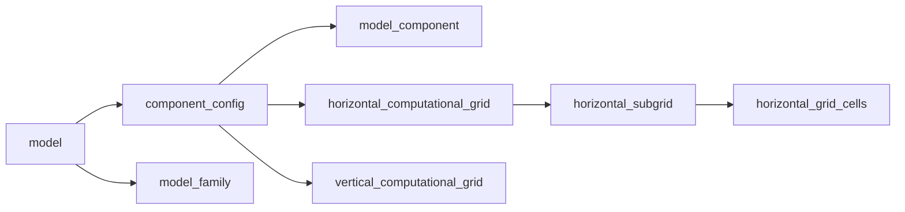
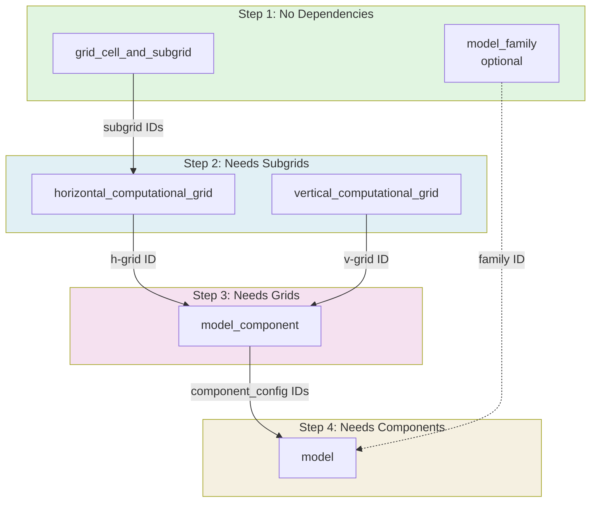

# EMD Submission Guide

## Overview

This guide explains how to register a model in the Essential Model Documentation (EMD) system for CMIP7.

## File Structure

The EMD system organizes model documentation into linked entities:



### Entity Descriptions

- **horizontal_grid_cells**: Physical grid cell properties (resolution, type, region)
- **horizontal_subgrid**: Variable types using those cells (mass, velocity, etc.)
- **horizontal_computational_grid**: Links subgrids together with arrangement (arakawa-c, etc.)
- **vertical_computational_grid**: Vertical coordinate and layer structure
- **model_component**: Component description (code, physics, references)
- **component_config**: Links component to its grids
- **model_family**: Group of related models (optional)
- **model**: Complete model with all components and relationships

## Dependencies



## Registration Steps

### Step 1: Grid Cells and Subgrids

**Form:** `grid_cell_and_subgrid`  
**Dependencies:** None

**Submit this form once for each unique grid cell pattern.**

**You provide:**
- Grid type (regular-latitude-longitude, tripolar, etc.)
- Grid mapping (latitude-longitude, rotated, etc.)
- Region (global, antarctica, etc.)
- Resolution (x, y in degrees or km)
- Number of cells
- Variable types for subgrid (mass, velocity, etc.)

**System creates:**
- horizontal_grid_cells (ID: g###)
- horizontal_subgrid (ID: s###, linked to g###)

**You receive:** Subgrid ID (s###)

**Review:** Submitted issue reviewed and merged

---

### Step 2: Computational Grids

#### Step 2a: Horizontal Computational Grid

**Form:** `horizontal_computational_grid`  
**Dependencies:** Subgrid IDs from Step 1

**Submit this form to link subgrids together.**

**You provide:**
- Subgrid IDs (s100, s101, etc.)
- Arrangement (arakawa-c, unstaggered, etc.)
- Description

**System creates:**
- horizontal_computational_grid (ID: c###, linked to subgrids)

**You receive:** Horizontal grid ID (c###)

**Review:** Submitted issue reviewed and merged

#### Step 2b: Vertical Computational Grid

**Form:** `vertical_computational_grid`  
**Dependencies:** None

**Submit this form for vertical layer structure.**

**You provide:**
- Vertical coordinate type (hybrid-height, depth, etc.)
- Number of layers
- Layer thicknesses
- Description

**System creates:**
- vertical_computational_grid (ID: v###)

**You receive:** Vertical grid ID (v###)

**Review:** Submitted issue reviewed and merged

**Note:** Steps 2a and 2b can be registered together

---

### Step 3: Model Family (Optional)

**Form:** `model_family`  
**Dependencies:** None  
**Can be done anytime**

**Submit this form if creating a new model family.**

**You provide:**
- Family name
- Description
- Primary institution
- Scientific domains

**System creates:**
- model_family (ID: family-id)

**You receive:** Family ID

**Review:** Submitted issue reviewed and merged

**Skip if:** Family already registered

---

### Step 4: Model Components

**Form:** `model_component`  
**Dependencies:** Horizontal grid ID (c###), Vertical grid ID (v###)

**Submit this form once for each dynamic component in your model.**

**You provide:**
- Component type (atmosphere, ocean, land-surface, etc.)
- Component name and description
- Component family (if applicable)
- Horizontal grid ID (c### from Step 2a)
- Vertical grid ID (v### from Step 2b)
- Code base URL
- Reference DOIs

**System creates:**
- model_component (ID: component-id)
- component_config (ID: domain_component-id_c###_v###)

**You receive:** Component Config ID

**Review:** Submitted issue reviewed and merged

**Repeat for each dynamic component**

---

### Step 5: Model

**Form:** `model`  
**Dependencies:** All component_config IDs, Family ID (if used)

**Submit this form to assemble your complete model.**

**You provide:**
- Model name (becomes CMIP7 source_id)
- Family (from Step 3, if applicable)
- Dynamic components (types)
- Prescribed components (types, if any)
- Omitted components (types, if any)
- Component config IDs (from Step 4)
- Embedded components (pairs: embedded,host)
- Coupling groups (groups: comp,comp,comp)
- Calendar
- Release year
- Reference DOIs

**System creates:**
- model (ID: model-id, your CMIP7 source_id)

**You receive:** Model ID

**Review:** Submitted issue reviewed and merged

**Registration complete!**

---

## Component Relationships

### Embedded Components

**Format:** One pair per line: `embedded,host`

**Example:**
```
aerosol,atmosphere
atmospheric-chemistry,atmosphere
sea-ice,ocean
```

**Meaning:** First component runs inside second component

### Coupling Groups

**Format:** One group per line: `comp,comp,comp`

**Example:**
```
atmosphere,land-surface,ocean
```

**Meaning:** All components in group exchange data directly

**Note:** Only non-embedded components can be in coupling groups

---

## Review Process

Each submission goes through review:

1. **Submission:** You submit GitHub issue form
2. **Validation:** Automated checks verify data
3. **Review:** Team reviews for completeness and accuracy
4. **Merge:** Issue merged, entities created
5. **ID provided:** You receive generated ID(s) for next step

**Wait for review completion** before proceeding to dependent steps.

---

## Getting Help

**Questions:** Submit `general_issue` form  
**Documentation:** [EMD Specification](https://wcrp-cmip.github.io/Essential-Model-Documentation/)  
**Browse registered entities:** https://emd.mipcvs.dev/
