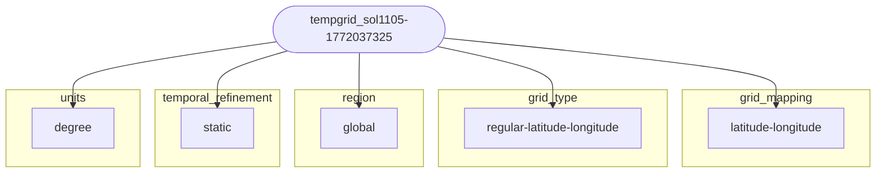

# Review Report: `tempgrid_sol1105-1772037325`

| | |
|---|---|
| **Kind** | `horizontal_grid_cell` |
| **Folder** | `emd:horizontal_grid_cells` |
| **Type** | `wcrp:horizontal_grid_cell, esgvoc:HorizontalGridCells` |
| **Generated** | 2026-03-01 15:30 UTC |

---

## Field Checklist

### Automatically validated

- [x] `horizontal_units` (_optional_): _not submitted_
- [x] `resolution_range_km` (_optional_): _not submitted_

### Schema fields

- [-] `description` (_optional_)
- [-] `grid_mapping` (_optional_)
- [x] `grid_type` (**required**): regular_latitude_longitude
- [-] `n_cells` (_optional_)
- [x] `region` (**required**): global
- [x] `southernmost_latitude` (_optional_): -89.5
- [-] `spatial_refinement` (_optional_)
- [x] `temporal_refinement` (**required**): static
- [x] `truncation_method` (_optional_): null
- [x] `truncation_number` (_optional_): null
- [x] `westernmost_longitude` (_optional_): 0.5
- [x] `x_resolution` (_optional_): 1.
- [x] `y_resolution` (_optional_): 1.

### Not in schema — manual review

- [ ] ⚠️ `coordinate_system`: latitude_longitude
- [ ] ⚠️ `number_of_cells`: 64800
- [ ] ⚠️ `units`: degree

---

> [!WARNING]
> **Validation errors** — these fields failed the esgvoc schema check and must be corrected before merging.
>
> | **Field** | **Error Type** | **Input Value** | **Input Type** | **Message** |
> | --- | --- | --- | --- | --- |
> | horizontal_units | value_error | `None` | None | Value error, horizontal_units is required when x_resolution or y_resolution are set |

---

## Link Similarity (RDF)

**5 semantic links** resolved from submitted values.

### Link graph

_No existing items exceed 80% link overlap._

All link comparisons

| Item | Overlap |
|------|---------|
| [`g100`](https://emd.mipcvs.dev/horizontal_grid_cells/g100.json) | 17.9% █░░░░░░░░░ |
| [`g104`](https://emd.mipcvs.dev/horizontal_grid_cells/g104.json) | 17.9% █░░░░░░░░░ |
| [`g102`](https://emd.mipcvs.dev/horizontal_grid_cells/g102.json) | 12.0% █░░░░░░░░░ |
| [`g106`](https://emd.mipcvs.dev/horizontal_grid_cells/g106.json) | 12.0% █░░░░░░░░░ |
| [`g105`](https://emd.mipcvs.dev/horizontal_grid_cells/g105.json) | 12.0% █░░░░░░░░░ |
| [`g101`](https://emd.mipcvs.dev/horizontal_grid_cells/g101.json) | 11.8% █░░░░░░░░░ |
| [`g103`](https://emd.mipcvs.dev/horizontal_grid_cells/g103.json) | 0.0% ░░░░░░░░░░ |

---

## Content Similarity

**Method:** embedding  
**Fields compared:** 7

### Fields used (click to view guidance)

<code>number_of_cells</code>: 64800

No notes given.

<code>southernmost_latitude</code>: -89.5

**Domain southern boundary**

In degrees north (-90 to 90).

For global grids with shifted pole, give latitude of southernmost cell center.

<code>truncation_method</code>: 

**Spectral truncation type** (spectral grids only)

- **triangular**: T truncation (most common, e.g., T127)
- **rhomboidal**: R truncation
- **linear**: L truncation (linear grid)

**Leave blank if:** Not a spectral grid.

<code>truncation_number</code>: 

**Maximum wavenumber** (spectral grids only)

Example: 127 for T127 truncation.

**Leave blank if:** Not a spectral grid.

<code>westernmost_longitude</code>: 0.5

**Domain western boundary**

In degrees east (0 to 360).

For global grids, typically 0 or first cell center longitude.

<code>x_resolution</code>: 1.

**Zonal (x-direction) resolution**

Nominal cell size. For spectral grids, use equivalent grid spacing.

**Leave blank if:** Resolution varies by more than 25% across the domain.

<code>y_resolution</code>: 1.

**Meridional (y-direction) resolution**

Nominal cell size.

**Leave blank if:** Resolution varies by more than 25% across the domain.

### Content similarity to folder items

| Item | Score | Bar |
|------|-------|-----|
| [`g102`](https://emd.mipcvs.dev/horizontal_grid_cells/g102.json) | 24.1% | ██░░░░░░░░ |
| [`g100`](https://emd.mipcvs.dev/horizontal_grid_cells/g100.json) | 20.4% | ██░░░░░░░░ |
| [`g104`](https://emd.mipcvs.dev/horizontal_grid_cells/g104.json) | 20.2% | ██░░░░░░░░ |
| [`g105`](https://emd.mipcvs.dev/horizontal_grid_cells/g105.json) | 18.0% | █░░░░░░░░░ |
| [`g101`](https://emd.mipcvs.dev/horizontal_grid_cells/g101.json) | 16.2% | █░░░░░░░░░ |
| [`g106`](https://emd.mipcvs.dev/horizontal_grid_cells/g106.json) | 12.5% | █░░░░░░░░░ |
| [`g103`](https://emd.mipcvs.dev/horizontal_grid_cells/g103.json) | 2.3% | ░░░░░░░░░░ |

---

_Report generated by [cmipld](https://github.com/WCRP-CMIP/CMIP-LD) `cmipld.utils.similarity.ReportBuilder`_
