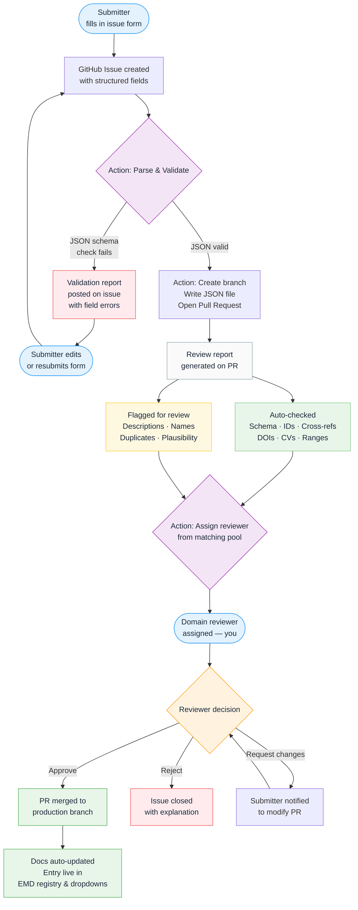

# EMD Reviewer Guide

This guide is for scientists assigned to review an EMD submission. It explains what the automated pipeline has already checked, what has been flagged for your judgement, and what your options are.

---

## How submissions reach you

Entries are submitted as GitHub issue forms — no Git knowledge is required from the submitter. Once submitted, an automated pipeline parses the issue, validates the data, creates a branch and JSON file, and opens a pull request. You are then assigned to that pull request.

By the time a PR reaches you, the automated checks have already passed. You are not being asked to re-run technical validation — you are being asked to apply scientific judgement to the items that cannot be checked automatically.

---

## What the automated checks already verified

These items are confirmed before the PR is opened. If any of these failed, the issue was sent back to the submitter and would not have reached you.

| Check | What was tested |
|---|---|
| **Schema validity** | All required fields are present and correctly typed |
| **ID uniqueness** | The proposed ID does not clash with an existing entry |
| **Cross-references** | Referenced IDs (grid IDs, family IDs, component configs) resolve to real entries |
| **DOI reachability** | Reference DOI URLs return a valid HTTP response |
| **Controlled vocabulary** | Dropdown values match the registered CVs (grid types, arrangements, calendars, etc.) |
| **Numeric ranges** | Values like `n_z`, `x_resolution`, and release year are within plausible bounds |

---

## What is flagged for your review

The review report on the PR highlights the following items. These require your scientific judgement — the pipeline cannot verify them automatically.

| Flag | What to check |
|---|---|
| **Description quality** | Is it scientifically accurate and complete? Does it mention all component types (dynamic, prescribed, omitted) where relevant? Is it specific enough to be useful to a data user? |
| **Name conventions** | Does the name follow the conventions used by other entries of this type? For models, does the `source_id` format match CMIP expectations? |
| **Potential duplicates** | A similar entry was detected. Is this genuinely new, or should the submitter be modifying an existing entry instead? |
| **Component completeness** | For models: do the dynamic/prescribed/omitted assignments together cover all the expected scientific domains for this model type? Is anything missing or misclassified? |
| **Scientific plausibility** | Do the values make scientific sense together? Examples of things to question: a 1 km global ocean grid, a land-only model with no land surface component, a release year before the model family was established. |

---

## Your options

After reviewing the flagged items and the JSON diff in the PR, take one of the following actions directly on the pull request.

| Action | How | Outcome |
|---|---|---|
| **Approve** | Approve the PR via the GitHub review interface | PR is merged immediately; entry enters the registry; docs update automatically within minutes |
| **Request changes** | Leave review comments specifying what needs to change; do not approve | Submitter is notified; they update the PR; it returns to you for re-review |
| **Reject** | Close the PR with a written explanation | Issue is also closed; submitter may open a new issue after addressing the concerns |

When requesting changes, be specific — quote the field name, state what is wrong, and where possible suggest the correction. Vague comments create unnecessary back-and-forth.

---

## Reviewer assignment

You were assigned because your scientific domain matches the submission type. Assignment also accounts for institutional independence from the submitting group and current reviewer workload.

You have **14 days** to respond before the submission is escalated to another reviewer. If you cannot review a particular submission (e.g. conflict of interest), re-assign it via the PR assignee field.

---

## After your approval

Once the PR is merged:

1. The JSON file is written to the vocabulary directory on the production branch
2. The docs build runs automatically — the entry appears on the EMD site within ~5 minutes
3. The entry becomes available in issue form dropdowns for other submitters to reference
4. For model submissions, the `source_id` is officially registered in the CMIP7 CVs
